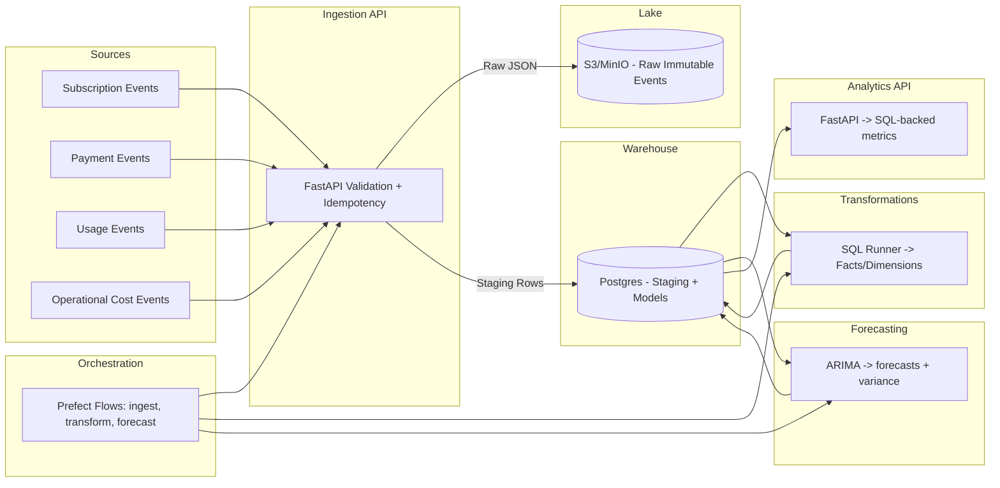

# Financial Forecasting Data Platform

## Overview
This project is a production-grade, end-to-end data platform that ingests business events, enforces data quality, models analytics-ready financial data, runs automated forecasts, and serves insights.

- Ingestion via REST and batch jobs
- Data quality with schema, null/range checks, duplicate detection, late-arrival handling, and quarantine
- Transformations to a star schema
- Forecasting for revenue and active subscriptions with variance analysis
- Orchestrated pipelines with retries, backfills, and observability
- Analytics API for MRR, churn, forecast vs actual, revenue by region
- Dockerized services with local Postgres and MinIO (S3-compatible)

## Architecture


## Repository Structure
```
financial-forecasting-platform/
├── ingestion/
├── validation/
├── transformations/
├── forecasting/
├── orchestration/
├── analytics/
├── infra/
├── tests/
└── README.md
```

Additional shared package: `platform_common/` containing config, DB, and S3 clients.

## Local Setup
1. Prereqs: Docker, Docker Compose, Make (optional)
2. Copy env: `cp env.example .env`
3. Start stack: `docker compose up --build`
4. Ingestion API: http://localhost:8000/docs

## Data Model
- Facts: `revenue_daily`, `subscriptions_snapshot`, `costs_daily`, `usage_daily`
- Dimensions: `customer`, `plan`, `region`, `time`
- Transformations run from `transformations/sql` via the runner.

## Forecasts
- Baseline ARIMA models for revenue and active subscriptions
- Stores forecasts, confidence intervals, and model metadata

## Orchestration
- Prefect flows to coordinate batch ingestion, transformation, and forecasting with retries and backfills.

## Design Decisions & Tradeoffs
- Postgres used locally as the warehouse for simplicity and portability
- MinIO provides an S3-compatible data lake locally; can be switched to AWS S3 via env
- Transformations implemented in SQL with a Python runner; dbt can be adopted with minimal changes

## How This Mirrors Real Systems
- Separation of raw immutable storage and modeled warehouse
- Strong data quality controls and quarantine for bad data
- Idempotent, replayable ingestion
- Orchestrated pipelines with observability
- Typed Python, tests, CI ready

## Next Steps
- Add analytics API endpoints and dashboards
- Implement full orchestration suite and CI workflow
- Expand tests and load sample data for demos
